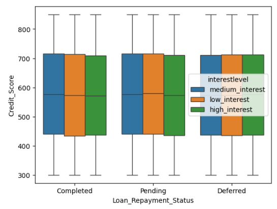
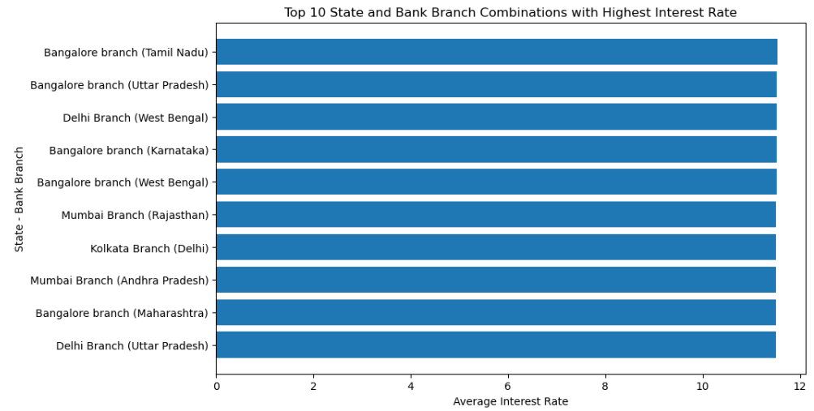

# # 📊 Financial Loan Analysis
### End-to-End Data Analytics Project

🎯 Turning raw data into meaningful business insights

---

## 🧠 Skills & Tools

---

## ▶️ How to Run This Project

1. Clone the repository
2. Open Jupyter Notebook
3. Run the notebooks in order:
   - Univariate Analysis
   - Bivariate Analysis
   - Multivariate Analysis
4. View outputs and visualizations

---

## 📓 Notebooks

- [Univariate Analysis](notebooks/Univariate%20of%20bank%20data%20(1).ipynb)
- [Bivariate Analysis](notebooks/bivariate%20of%20bank%20data.ipynb)
- [Multivariate Analysis](notebooks/Multivariate%20of%20bank%20data.ipynb)

---

## 🔄 Project Workflow

1. Data Collection
2. Data Cleaning & Preprocessing
3. Exploratory Data Analysis (EDA)
4. Univariate, Bivariate, Multivariate Analysis
5. Visualization & Insights
6. Business Recommendations

---

## 🛠️ Tools & Technologies

- **Python**: Data cleaning, analysis, and visualization  
- **Pandas & NumPy**: Data manipulation  
- **Matplotlib**: Data visualization  
- **Jupyter Notebook**: Interactive analysis  
- **Power BI**: Dashboard creation and presentation  
- **Excel**: Initial data handling

---

## 📸 Visual Insights

### Loan Distribution
Shows skewness and presence of outliers in loan amount

### Correlation Heatmap
Displays relationships between numerical variables

---

## ⚠️ Limitations

- Dataset may not represent all real-world scenarios  
- Some variables lack detailed business context  
- Outlier handling may affect extreme case analysis

---

## 🚀 Future Improvements

- Build predictive model for loan approval  
- Integrate real-time data  
- Develop interactive dashboard in Power BI  

---

## 📊 Featured Projects

### 🏦 Bank Loan Analysis
- Cleaned and analyzed 200K+ records
- Identified customer segments & loan trends
- Detected ~15% outliers in loan distribution
- Delivered actionable business insights

---

 ## 💡 Business Impact
- Identified high-risk loan segments to improve risk management
- Enabled better customer targeting strategies for financial institutions

---

## 📈 Key KPIs

- Total Loan Applications
- Average Loan Amount
- Default Rate
- High Risk Customers
- Approval vs Rejection Ratio
- Average Credit Score

---

## 🧠 Business Questions Solved

1. Which customer segment has highest default risk?
2. Which age group takes highest loans?
3. What factors affect loan repayment?
4. Which regions generate risky loans?
5. Which interest level performs best?

---

## 📌 Strategic Recommendations

- Reduce loan exposure in high-risk categories
- Improve targeting for medium-risk customers
- Create customized repayment plans
- Increase monitoring for deferred repayment accounts

---

## 📌 Recommendations
- Focus marketing efforts on customers aged 26–55
- Monitor and control high-value loan outliers
- Customize loan offerings based on occupation segments

🔗 [View Project](https://github.com/mohammedkaifmomin18-beep/Bank-Loan-Analysis)

---

## 📈 GitHub Stats

---

## 📫 Contact
📧 mohammedkaifmomin18@gmail.com

